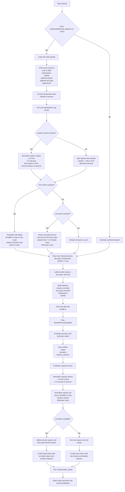

# Data Preprocessing Workflow

This diagram reflects the current preprocessing logic implemented in `backend/train_model.py` and `backend/app/ml_model.py`.

## Notes

- If `crop_dataset.csv` is missing, the training pipeline falls back to a synthetic dataset.
- Soil normalization is not fully consistent between training and inference: training uses `Clay Loam` and `Sandy Loam`, while inference maps to `Clay` and `Sandy` before encoder fallback.
- The saved artifact bundles the trained model and the encoders used to transform categorical inputs.
