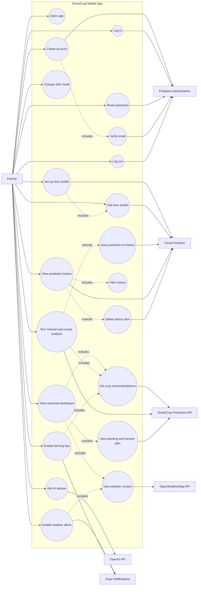

# SmartCrop Use Case Diagram

## Actors

- Farmer: the primary user who signs in, manages a farm profile, gets crop advice, saves results, and manages alerts.
- Firebase Authentication: handles account creation, login, logout, email verification, and password reset.
- Cloud Firestore: stores farm profile data and prediction history.
- SmartCrop Prediction API: provides soil-zone data, sub-county crop recommendations, and season planning.
- OpenWeatherMap API: provides current weather context for Luwero.
- OpenAI API: powers AI advisor responses.
- Expo Notifications: schedules farming tips and weather alerts on the device.

## Main Use Cases

- Account access: create account, verify email, log in, reset password, and log out.
- Farm profile: set up or edit name, region, sub-county, mapped soil type, and profile photo.
- Seasonal dashboard: view recommended crops, weather context, risk signals, and planting or harvest timing.
- Manual analysis: choose a sub-county, run analysis, and optionally save the result.
- History: view saved recommendations, filter by year or season, load more records, and delete records.
- AI advisor: ask farming questions using the user's sub-county, soil type, and current season as context.
- Preferences: change dark mode, enable farming tips, and enable weather alerts.
